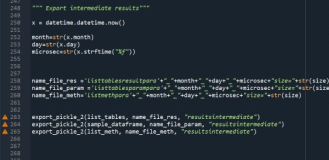
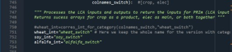

# Code documentation for the AVS_stochastic_sd repository

## Overview of the repository

This repository contains the code used to reproduce the results of the manuscript: *Jouannais.P, Marchand-Lasserre.M, Douziech.M, Pérez-López.P, When is Agrivoltaics Environmentally Beneficial? A Consequential LCA and Scenario Discovery Approach (under review)* 

This is not a generalized platform/package to apply the procedure to any case, but the scripts specific to the procedure and not to the case (agrivoltaics) can be further adapted with additional work.

**Cite this repository:**


[](https://doi.org/10.5281/zenodo.13861243)

 
### Overview of folders and files:


**Environment**

+ **environment.yml** File needed to create the virtual environment on WINDOWS.


**PRIM_process**

Output folders where results are exported to.

**PRIM_modif**

Contains a prim script that needs to replace the original one in the prim package to allow it to work with float16.

**resultsintermediate**

Output folders where results are exported to.


**Scripts** 

+ fifteen **.py** files: python scripts including the ones to execute and the ones containing functions being called. 


Files, scripts, and their functions'interconnections are mapped below.  
<br>  

  
<br>  


**Activities**

Collects ecoinvent activities under variable names that will be called by other scripts.

**util_functions**

Contains accessory functions.


**Stochastic_LCAs**

Computes the stochastic LCAs.


**PRIM_process**

Applies PRIM over the stochastic LCAs.

**Plot_functions**

Contains plot functions.


**Plot_from_dict**

Plots the figures with the boxes limits. 

**Parameters_and_functions**

Definition of the model's parameters and functions.

**Main_functions**

Main functions performing the LCAs and the PRIM algorithm.

**Export_double_checked_boxes**

Updates the identified boxes by only keeping and exporting the valid ones after double-checking.

**Export_double_checked_boxes**

Updates the identified boxes by only keeping and exporting the valid ones after double-checking.

**Check_boxes**

Double-check found boxes by computing the actual density of the found boxes.

**Export_boxes_xlsx**

Exports boxes into a xlsx file.

**Creation_Database_1**

Sets up the foreground database.

**Creation_Database_2**

Finishes setting up the foreground database.


**Compute_specific_configurations**

Computes and plots the LCA results of specific tested configurations.


**Setup_bw_project** 

Creates the Brightway2 project and imports ecoinvent 3.10 consequential and the biosphere.


<br>

### Reproducing results of the article

  &#128680;&#128680;&#128680;**WARNING 
The PRIM application requires substantial computing capacities (large memory/multiple CPUS). Several days of computations are necessary to reproduce the results, by using multiple instances with multiple cores. Most of the functions are written to be called in parallel with the package "ray".


*Requirements*

+ Miniconda or Anaconda
https://docs.conda.io/projects/conda/en/latest/user-guide/install/index.html

+ The ecoinvent license (we used ecoinvent 3.10 consquential)

+ A python interface (e.g., Spyder)


*Step by step procedure:*

1. **Download or clone a local copy of the repository. Keep the folders structure.**

2. **Prepare a conda environment with all needed packages**

+ From terminal or Anaconda/Miniconda terminal access the "Environment" folder. The path depends on where you saved the repository:

```
 cd <yourpathtothefolder/Environment>
```

+ Create the conda environment with all necessary packages using the .yml file corresponding to your OS.

**For Windows:**


```
conda env create --file env_bw_windows.yml
```

+ Activate the newly created environment:

```
conda activate AVS_stochastic_sd_env
```

+ Install the ecoinvent_interface package from conda:
```
conda install ecoinvent_interface
```


+ Install the ray package from pip:
```
pip install ray
```

**For Ubuntu and MACOS:**


Try to install the environment from the environment file and, in case of issues, complete the environment by installing the problematic packages manually. 


3. **Replace the "prim.py" script in the ema_workbench package**
+ Copy the "prim.py" script in the PRIM_modif folder and replace the original one in the package. Find the location of the original prim file among the conda files by typing help(prim) after you import it in a python file. The modified prim file allows it to work with float16.

4. **Set up the Brigtway2 project**

+ Open the file **Setup_bw_project.py** in a text editor or python interface and change the password and username for your ecoinvent license. . 

+ From the python interface or from command, execute the whole script to prepare the Brightway2 project (```python Setup_bw_project.py```) .

+ From the python interface or from command, execute the script **Creation_Database_1.py** and then **Creation_Database_2.py** to setup the foreground database (```python Creation_Database_1.py```) .


5. **Compute** 

5.1 ***Compute stochastic LCAs***

+ Open the file **Stochastic_LCAs.py**. 

+ The script is parameterized for 400000 iterations. Change the number of simulations if needed and run the simulation by executing the whole script from the python interface or from command line. WIll save the intermediate results into the folder "intermediateresults".


5.2 ***Apply PRIM***

+ Open the file **PRIM_process.py**. 

+ Change the path to the corresponding files in the intermediate results generated in 4.1. If necessary, update the output file names. 

+  Apply PRIM by running the whole script. It will save the dictionaries of results into a subfolder "dict_results" in the folder "PRIM_process".


5.3 ***Check boxes and keep only valid boxes***

+ Open the file **Check_boxes.py**. 

+ Change the path to the corresponding output files with the dictionaries files generated in 5.2. If necessary, update the output file names. 

+ Execute the whole script from the python interface or from command line. This will run stochastic LCAs within the discovered boxes and export valid boxes number within "check_boxes" output files into the subfolder "Boxes" in the folder "PRIM_process".

+ Open the file **Export_double_checked_boxes.py**. 

+ Change the path to the corresponding "check_boxes" input files that were just created, and to the original dictionaries of results generated in 5.2. If necessary, update the output file names.

+ Execute the whole script from the python interface or from command line.It will save the updated dictionaries of results into a subfolder "dict_results" in the folder "PRIM_process".

5.4 ***Plot***

+ Open the file **Plot_from_dict.py**. 

+ Change the path to the input files for the result dictionaries generated in 5.3 (double-checked boxes). 

+ Execute the whole script from the python interface or from command line.It will plot the figures into a subfolder "plot_scernarios" in the folder "PRIM_process".

5.5 ***Export results under xlsx format***

+ Open the file **Export_boxes_xlsx.py**. 

+ Change the path to the input files for the result dictionaries generated in 5.3 (double-checked boxes). 

+ Execute the whole script from the python interface or from command line. It will export the results into the folder "PRIM_process".

5.6 ***Compute LCAs for specific configurations***

+ Open the file **Export_boxes_xlsx.py**. 

+ Change the path to the input files for the result dictionaries generated in 5.3 (double-checked boxes). 

+ Execute the script  **Compute_specific_configurations.py ** from the python interface or from command line. It will export the results into a csv and will plot the figures.

<br>

<br>

## &#128680;Adapting the code to other uses

### Simulating specific configurations


The scripts were coded to ease the parallel computation of stochastic configurations but can be adapted to compute specific configurations. Simple modifications can be done to model AVS over different crops.
A) explains how to model specific configurations without modifying the code structure.
B) explains how to use a new crop type.
C) explains how to use another marginal electric mix.


<br>

 &#128308; **A) Model specific configurations without modifying the code structure** 


A.1 ***Set the values in the dictionary of parameters***

In the script **Parameters_and_functions.py**, the parameters dictionaries are defined from line 42.  There are three dictionaries: the one containing the parameters related to the PV part (PV_par_distributions), to the agricultural part (Ag_par_distributions), to the iLUC part (“iluc_par_distributions”).


+ To model a single configuration, without foreground uncertainty, set all the parameters to “unique” in the dictionaries. When set to “unique” as the first value of the list associated with a parameter in a dictionary, the model only considers the first value of the list in second position. The other values are not used as inputs.
 

+ There are two “switch” parameters that should not be set to “unique”:

-	To model a unique crop type, use “prob_switch_crop”. Set the probability to 1 for the corresponding crop type located in the same position in the list on the right, and the others to 0.  In the snapshot below, the chosen crop type is “soy”. 


 


-	The parameter “prob_switch_substielec” allows to switch between a substitution of marginal electricity or of PV electricity induced by AV crops. The substitution of PV electricity does not follow the consequential approach and was just left possible to run validation tests. No need to modify this parameter as it is already set to marginal electricity.


A.2 ***Set up the main script and execute***

The script to be executed to run LCAs is **Stochastic_LCAs.py**. Open it.

+ Set the number of stochastic iterations to 1, we only want to assess 1 configuration. l129


+ We cannot have more CPUs working than the number of configurations. Set the number of CPUs working in parallel to 1.L134. From 


 

+ To 


 

+ Select the impact categories ("methods") you want to assess. From line 40, collect the methods you want (list(bd.methods()) to get a list of the loaded methods) and put the variables in the list "list_meth". You can put as many as you want.


+ Select your FUs. l 226, the original FUs are : AVS_elec_main (AVS electricity when main product), PV_ref (conventional (updated) PV electricity), AVS_crop_main (AVS crop when main product), wheat_fr_ref (Conventional (updated) wheat production),soy_ch_ref (Conventional (updated) soy production),alfalfa_ch_ref (Conventional (updated) alfalfa production), elec_marginal_fr_copy (marginal (updated) french electric mix). 


Make sure that the activities you choose has previously been defined as a variable in the script **Activities.py**. 


You can choose as many FUs as you want.


+ The list containing the results "list_tables" is organized as a list of dataframes with one dataframe for each impact category. 


+ Execute the whole script.If you execute the whole script, it will save "list_tables" under a pickle format according to the paths specified at the end of the script. Change them if necessary. 




<br>


&#128308;**B) Add other crop types** 


If you want to model other types of crops under the PV panels, you 'll need to adapt the code and the creation of foreground database. 


**B.1) If you start from an existing ecoinvent agricultural activity** 

***In the script Creation_database_1.py***


+ Find the original ecoinvent activity you want to model and define it in the script.


No need to delete the original crop activities.

+ Copy paste and adapt the lines that will create 3 modified copies of the new crop for the updated conventional, AVS with elec as main product, and with crop as main product, as it's done from line 320 to 380 for wheat, soy and alfalfa. Give them the same name as the variable name. 


+ Add these new modified crop activities to the AVS activities as done in line 387 to 395.Add the "elec_main" activity to AVS_elec_main and the "crop_main" to the "AVS_crop_main".


+ Add the soil carbon accumulation inputs to the new activity as in lines 431-433


+ Add the iLUC markets to the new activity as in lines 497-501.


***In the script Activities.py***


+ Call the new crop activities that you created lines 49-69 and collect the original yield of the activity (lines 54-57). 


+ From lines 232 to the end of the script, the different activities and emissions associated with parameterized inputs (or emissions) to the original ecoinvent crop activities are collected.
You only need to collect the activities for the inputs that you want to parameterize.
The easiest is to follow the level of parameterization already followed:

-Inputs/emissions associated with fertilization intensity (N,P,K, possible machinery for spreading fertilizers, N,P,K emissions)

-Inputs/emissions associated with irrigation 

-Inputs/emissions associated with machinery use (outside fertilization)


These activity variables will then be used to locate where the dedicated functions should apply in the script ***Parameters_and_functions.py***.

<br>

***In the script Parameters_and_functions.py***

+ line 77 to 80, collect the original yield of your crop activity.


+ line 961. Create a crop switch function for your new crop activity. Copy the format of the original switch functions line 961-990. Write the function just after them.


+ From line 1191 to line 1693, dict_funct is a dictionary containing the functions calculating the amounts of the exchanges in the foreground according to the parameters'values. The functions are defined above in the script, and are associated in this dictionary to the coordinates of exchanges in the technosphere and biosphere matrices.


+For f28, the function for the iluc input, add your crop activity:


+ Add your new crop switch function in the dictionary after f36, use the same strucutre as f36,35,34. Remember to change the key of each function in the dictionary afterwards to avoid having two functions with the same key. For the rest of the guide, I will keep mentioning the original functions keys in the dictonary.


+ For f37 up to f47 included, add the coordinates associated with your new crop activity. Follow the same structure as already implement for each function. Pay attention to whether the type of activity is "crop_main", "elec_main" or "ref". Note that as different crops have different inputs, the indices are not necessarily the same for each crop type in each function. Add the indices corresponding to the input activities that you chose to parameterize for activity (cf.B.1 In the script activities).


+ In the dictionary for agricultural parameters(line 83), modify the prob_switch_crop parameter to include your new activity. There are now 4 options, and the probability is set to 1 for the new one.
From


to 


***In the script Main_functions.py***

+ In the function "prep_for_prim_all_categ_all_main" lines 750 to 753, add your crop typ : "my_crop_int = "my_crop_switch""




+ in the same function, expand the structure of the lines 777 to 787 for your new crop.


+ do the same for the function "prep_for_prim_1_categ_all_main" from line893


***In the script Stochastic_LCAS.py***

+Line 226, Remember to add your new crop activity (the "ref version") in the list_fu in the executable script ***Stochastic_LCAS.py***.


After your modification, recreate the foreground database by executing ***Creation_Database_1.py*** and ***Creation_Database_2.py***.

**B.2) If you are building an inventory for another crop ** 

Build your inventory in the foreground database or another one and follow the steps in B.1 as if it was an ecoinvent activity.

After your modification, recreate the foreground database by executing ***Creation_Database_1.py*** and ***Creation_Database_2.py***.

<br>
<br>
<br>
&#128308;**C) Changing the electricity market** 

The co-produced electricity when crop is the main product currently substitutes the french marginal mix.

To change it to another mix:

***In the script Creation_database_1.py***

+ l 514 to end, choose another electricty mix and replace the original one with it in the code.


***In the script Creation_database_1.py***

+ l 514 to end, choose another electricty mix and replace the original one with it in the code.


***In the script Activities.py***

+ line 76, 77, call your new mix instead of the french mix.


***In the script Parameters_and_functions.py***

+ line 1300 in the function f16, replace the french mix with your mix.


***In the script Stochastic_LCAS.py***

+ In lines 162 to 166, replace the french mix copy with yours.


+ In line 232, replace the french mix copy with yours in the list of FUs.


After your modification, recreate the foreground database by executing ***Creation_Database_1.py*** and ***Creation_Database_2.py***.
